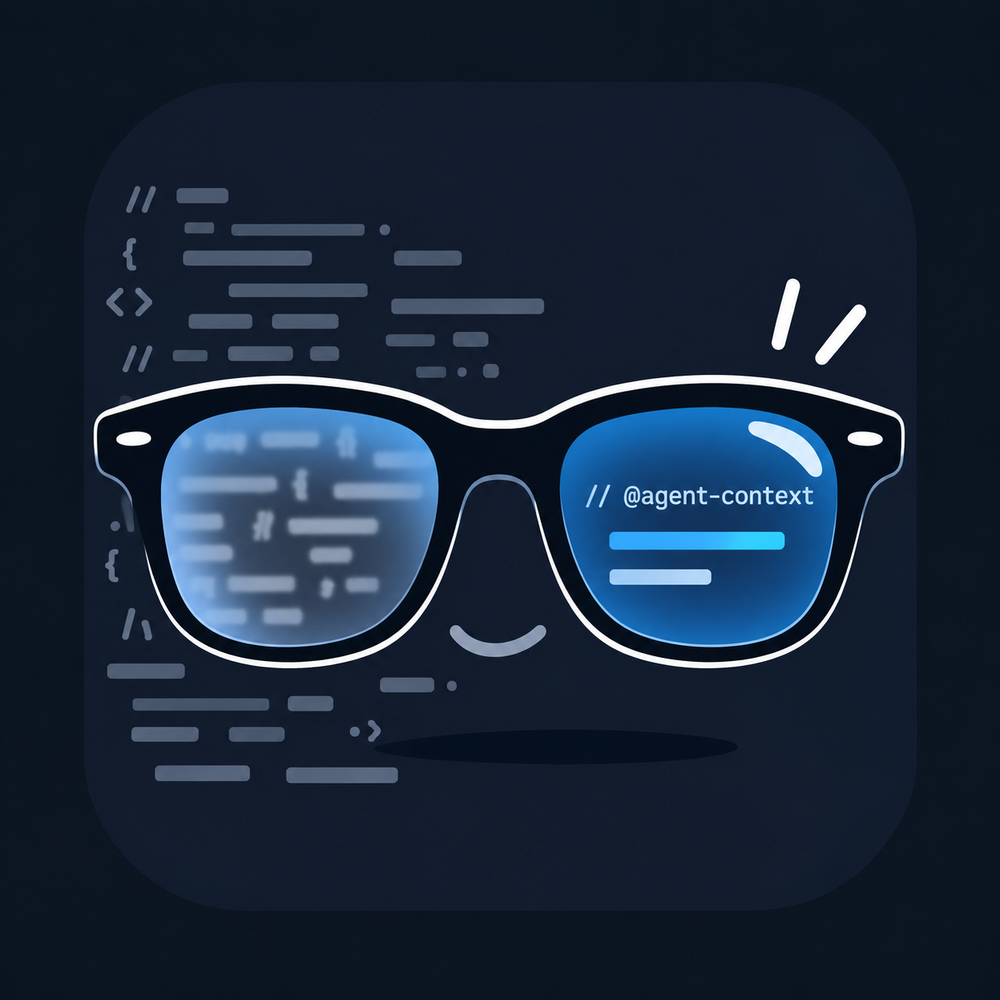

# HumanEye

<p align="center">
  
</p>

HumanEye makes code human-readable again by folding durable, agent-directed maintenance comments out of the normal reading flow. `@agent-context` is the editor-independent annotation specification that HumanEye implements; HumanEye is the extension and product name.

This monorepo contains the HumanEye VS Code extension, a browser integration for GitHub, and the shared `@agent-context` parser.

## Requirements

- Node.js 24+
- pnpm 10+

## Install

```bash
pnpm install
```

## Build everything

```bash
pnpm build
```

## Build individual packages

```bash
pnpm build:core
pnpm build:vscode
pnpm build:browser
```

## Typecheck

```bash
pnpm typecheck
```

## Layout

```text
packages/core   Shared @agent-context parser, types and semantics
apps/vscode     HumanEye for VS Code
apps/browser    HumanEye Chrome/Chromium extension for GitHub
```

## Browser development

After `pnpm build:browser`, open `chrome://extensions`, enable Developer mode, choose **Load unpacked**, and select `apps/browser/dist`.

## VS Code development

Open `apps/vscode` in VS Code and add a normal extension-development launch configuration, or wire the repo root as a multi-root workspace. The built entrypoint is `apps/vscode/dist/extension.js`.

The permanent Visual Studio Marketplace publisher ID is `ischouten`, making the extension identity `ischouten.human-eye`.

## VS Code MVP and packaging

The shared parser and VS Code integration are implemented. The browser package remains a placeholder for the next phase. See [the roadmap](docs/ROADMAP.md) and [the grammar contract](docs/GRAMMAR.md).

Run `pnpm test`, `pnpm typecheck`, and `pnpm package:vscode`. Individual extension builds include their core dependency. Packaging creates `apps/vscode/human-eye-<version>.vsix` with the bundled runtime and no external runtime dependencies. If pnpm is not installed, use `npx --yes pnpm@10.15.1` in place of `pnpm`.

GitHub Actions validates and packages on pushes, pull requests, and manual runs. Download `human-eye-vsix` from the validation workflow artifacts, extract it, and install the VSIX using VS Code's **Extensions: Install from VSIX** command. Packaging uses Microsoft's [vsce tooling](https://code.visualstudio.com/api/working-with-extensions/publishing-extension).

Marketplace publishing is prepared through the manually dispatched **Publish HumanEye for VS Code** GitHub Actions workflow. The workflow repeats the tests and type checks, packages the VSIX, waits for any protection configured on the `visual-studio-marketplace` GitHub environment, and uses Visual Studio Marketplace trusted publishing. Once the Marketplace exposes trusted-publishing policy configuration, configure publisher `ischouten` to trust the `ischouten/human-eye` repository, `.github/workflows/publish-vscode.yml` workflow, and `visual-studio-marketplace` environment. GitHub will then exchange its OIDC token directly for a short-lived Marketplace credential; no GitHub secret, Microsoft Entra application, client secret, or Marketplace PAT is needed. The workflow temporarily pins `@vscode/vsce` 3.9.3-12 because the OIDC client is present in that published prerelease while the Marketplace policy UI and stable VSCE release are still pending.

For local debugging, run `pnpm build:vscode`, then launch **HumanEye Extension** from the root VS Code Run and Debug view.

### Manual acceptance check

Open a source file containing a multiline annotation. It should fold to one horizontal rule with no reserved blank rows. Hover the rule, then click the folding control in the gutter to expand and collapse it. Try `all` and `custom` visibility, edit the annotation type, open the same document in two editor groups, and disable the extension setting. Verify both groups refresh and ordinary code stays visible.

HumanEye is published as `ischouten.human-eye` under the [MIT License](LICENSE).
